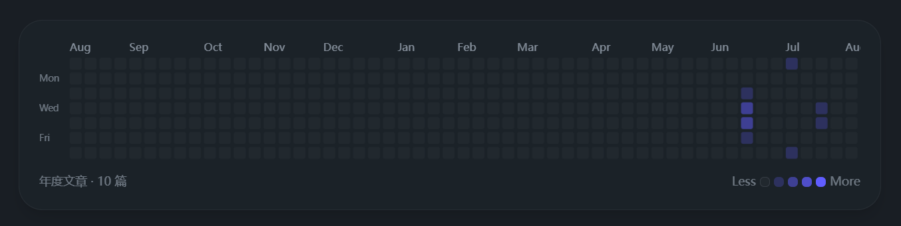

# 文章发布热力图组件 · 实现方案

> 状态：方案评审稿（已按《docs/审核/文章热力图组件-方案评审.md》修订，待 ClaudeCode 实现）
> 目标主题：Serendipity-Grace（`theme-serendipity`，Halo 2.x）
> 需求来源：用户任务文档《为 Halo 2.x 主题内置 GitHub 风格文章热力图组件》
> 分工：本方案由 Codex 提供，ClaudeCode 负责实现
> 修订记录：2026-08-10 依据方案评审报告修订——修复 2 处 P0（fragment `data-*` 注入、`th:if`+`th:replace` 开关失效）、7 处 P1（归档链接前导零、CSS 变量名、暗色方向、tooltip 裁剪、事件时序、资源门控、后台验收），并补全验证清单。

---

## 一、需求理解与目标

在主题内内置「文章发布热力图」（GitHub Contribution Graph 风格），满足：

1. **零插件依赖**：纯主题侧实现，不依赖任何 Halo 插件
2. **数据自获取**：前端通过 Halo 公开 Content API 获取文章列表，按 `spec.publishTime` 统计每日发布数
3. **组件化**：独立模板 fragment + CSS + JS，任意页面一行引入
4. **开箱即用**：主题后台开启开关即可在归档页显示，无需用户写代码


> 参考效果图（截自其他博客，GitHub Contribution Graph 风格）：
### 效果规格（来自需求）

- 7 行（周一→周日）× 全年默认约 53 列（近一年）；方格 12×12px、圆角 2px、间距 3px
- 5 级绿色色阶（Level 0–4），亮/暗模式两套
- 顶部月份缩写标签（仅每月首列上方）、左侧 Mon/Wed/Fri 星期标签
- 悬停 tooltip：「2026年1月15日 · 2 篇文章」
- 底部「年度文章 · N 篇」统计 + Less/More 切换（半年/全年）
- 点击某日跳转该年月归档页（可选开关）

---

## 二、技术选型与架构

### 2.1 数据源：Halo Content API（匿名公开）

```
GET /apis/api.content.halo.run/v1alpha1/posts?page={p}&size=100&sort=spec.publishTime,asc
```

- 返回 `{ page, size, total, items }`（另有 first/hasNext/hasPrevious/last/totalPages）；item 关键字段：
  - `spec.publishTime`（ISO-8601 UTC 字符串，如 `2026-01-15T10:30:00Z`）
  - `spec.title`、`status.permalink`（点击跳转备用）
- **Content API 天然只返回已发布且公开的文章**（匿名场景精确成立）：过滤机制是「已发布」标签 `content.halo.run/published=true`（由 PostReconciler 在真正发布时写入，定时发布到点前不打标签）+ `spec.visible=PUBLIC` + 未删除未回收站，满足「只统计已发布的公开文章」口径
- 主题内已有先例：`search.js` 用同一接口拉文章列表、`archives.js` 用 `sort=metadata.creationTimestamp,desc`
- **分页策略**：`size=100` 循环翻页，直到累计 `items.length == total` 或返回空；设置页数上限（20 页）防死循环
- **官方依据（已核实，非臆测）**：
  - `page`/`size`/`sort` 参数与 `{page,size,total,items}` 返回结构：Halo 源码 `PostQueryEndpoint`/`PostPublicQuery`/`ListResult` + OpenAPI 生成物 `post-v1alpha1-public-api.ts`
  - `sort=spec.publishTime,asc`：官方维护者 ruibaby 在 halo-dev Discussion #6796 给出同款写法并获确认可用；`SortableRequest` 支持 `字段,asc|desc`；Halo 内部 `PostFinderImpl` 默认排序即含 `spec.publishTime`
  - `page` 服务端归一 1-based（`PageRequestImpl`），从 `page=1` 起拉取正确；`size` 上限 1000，`size=100` 安全
  - `total` 语义为「符合条件的跨页总元素数」（`ListResult` "Total elements."），`all.length < total` 循环条件正确

> 备选路径（不采用，仅记录）：Halo 主题服务端 finder API（`postFinder.listAll()`）可在服务端渲染全部文章，无请求、无分页、SEO 更优。但需求明确要求 Content API，主线按前端异步实现；若未来需要无 JS 兜底，可再切服务端渲染。

### 2.2 渲染技术：CSS Grid（div 网格）

- 不选 SVG：div 网格对 tooltip（CSS `::after`）、点击 `<a>`、调试、可访问性更友好，且 PJAX 下无需重建 SVG 命名空间
- 布局：`grid-auto-flow: column` + `grid-template-rows: repeat(7, 12px)`，列优先（每周一列）
- 尺寸验证：53 列 = 53×12 + 52×3 = **792px**；7 行 = 7×12 + 6×3 = **102px**，与 `.archive-main`（`min-width:0`）配合可在移动端触发横向滚动

### 2.3 组件结构

```
templates/modules/heatmap.html      # fragment：容器 + data-* 配置透传（th:attr 注入）
templates/assets/css/heatmap.css    # 卡片/网格/色阶/tooltip/标签样式
templates/assets/js/heatmap.js      # 拉数据(分页) → 统计 → 渲染 → Less/More
settings.yaml                       # 新增 heatmap 配置组（第 17 组）
templates/archives.html             # 默认集成点（受开关控制，CSS/JS/fragment 三处门控）
templates/index.html / about.html   # 可选集成（方式 B）
```

---

## 三、配置设计（settings.yaml）

在 `settings.yaml` 末尾（`music` 组之后）追加第 17 个配置组（已核实现有恰为 16 组：basic/hero/welcome/social/compass/home/post/footer/sidebar/about/seo/watermark/projects/links/starGallery/music）：

```yaml
    - group: heatmap
      label: 写作热力图
      formSchema:
        - $formkit: switch
          id: heatmap_enabled
          name: enabled
          label: 启用文章热力图
          value: false
          help: 在归档页显示 GitHub 风格的文章发布热力图（不依赖插件，数据来自 Halo Content API）
        - $formkit: text
          name: title
          if: $get(heatmap_enabled).value
          label: 卡片标题
          value: "写作热力图"
        - $formkit: select
          name: defaultRange
          if: $get(heatmap_enabled).value
          label: 默认显示范围
          value: more
          options:
            - label: 全年（约 53 列）
              value: more
            - label: 半年（约 26~27 列）
              value: less
          help: 用户可通过底部 Less/More 按钮切换
        - $formkit: switch
          id: heatmap_clickable
          name: clickable
          if: $get(heatmap_enabled).value
          label: 点击跳转归档
          value: true
          help: 点击某天的格子跳转到该年月的归档页（/archives/{年}/{月}，月需两位，如 /archives/2026/01）
        - $formkit: switch
          name: showStats
          if: $get(heatmap_enabled).value
          label: 显示统计文字
          value: true
```

- 缩进层级（4/6/8/10 空格）与 `switch + id + if: $get(...)` 联动写法与现有 links/music/watermark 组一致（已核实），Halo 后台可识别。
- 模板侧读取：`theme.config.heatmap?.enabled == true`、`theme.config.heatmap?.title ?: '写作热力图'`（新代码用安全导航，遵循 CLAUDE.md 约定；与 archives.html 现有 `theme.config.watermark?.archives?.enabled == true` 先例同型）。
- **决策点（二选一，不能混）**：本方案采用**扁平字段**（enabled/title/... 直接挂 `formSchema`，先例 basic 组，读取路径 `theme.config.heatmap.<field>`）。若实现时改为仿 links 包一层 `$formkit: group name: heatmapConfig`，模板读取路径必须同步改为 `theme.config.heatmap.heatmapConfig.<field>`。

---

## 四、fragment 设计（templates/modules/heatmap.html）

参考 `modules/watermark.html` 的 fragment 写法：

```html
<!DOCTYPE html>
<html xmlns:th="https://www.thymeleaf.org">

<th:block th:fragment="heatmap">
  <section class="heatmap-card" data-heatmap
    th:attr="data-title=${theme.config.heatmap?.title ?: '写作热力图'},
             data-range=${theme.config.heatmap?.defaultRange ?: 'more'},
             data-clickable=${theme.config.heatmap?.clickable == true ? 'true' : 'false'},
             data-show-stats=${theme.config.heatmap?.showStats != false ? 'true' : 'false'}"
    data-aos="fade-up">
    <!-- 内容由 heatmap.js 异步渲染，骨架占位 -->
    <div class="heatmap-body">
      <div class="heatmap-loading">正在加载写作热力图…</div>
    </div>
  </section>
</th:block>

</html>
```

说明（评审 P0-1 已修正）：

- **`data-*` 配置必须用 `th:attr` 注入**：Thymeleaf 只处理 `th:*` 属性，`data-title="${...}"` 这类裸属性会原样输出字面量，JS `dataset` 读到模板字符串本身、配置全部失效。写法与仓库先例 `archives.html` L129 `th:attr="data-api=..."` / L153 `th:attr="data-comment-count=..."` 一致。
- JS 统一从 `container.dataset` 读取配置——保持 JS 与 Thymeleaf 解耦。
- 静态打开 HTML 时 `data-*` 属性不存在（`th:attr` 为服务端指令），**默认值由 JS 侧兜底**（`dataset.title || '写作热力图'` 等，见 §6.5），并非 Thymeleaf inline 回退（CLAUDE.md 的 `/*[[${...}]]*/ 默认值` 仅适用于 JS inline，不适用于属性）。
- `data-aos` 与主题入场动画体系一致；PJAX 下主题 main.js 已对新 `[data-aos]` 元素自动加 `aos-animate`（`main.js` L461-473），不会空白。

---

## 五、CSS 设计（templates/assets/css/heatmap.css）

### 5.1 色阶（CSS 变量，暗色为基 + 亮色覆盖）

> 评审 P1-3 已修正：主题机制是「**暗色为基**」——`:root` 全部暗色值（base.css L9-56），亮色用 `[data-theme="light"]` 覆盖（base.css L161-177，组件先例 `archives.css` L117 `[data-theme="light"] .archive-card`）；`data-theme` 挂在 `<html>`（layout.html L15）。**不要**按「亮色默认 + `[data-theme="dark"]` 覆盖」反向写，否则 head 内联脚本未执行（CSP/noscript/静态预览）时，暗色页面会出现一块亮色卡片。

```css
.heatmap-card {
  --hm-l0: #161b22; /* 暗色（默认） */
  --hm-l1: #0e4429;
  --hm-l2: #006d32;
  --hm-l3: #26a641;
  --hm-l4: #39d353;
}

[data-theme="light"] .heatmap-card {
  --hm-l0: #ebedf0; /* 亮色覆盖 */
  --hm-l1: #9be9a8;
  --hm-l2: #40c463;
  --hm-l3: #30a14e;
  --hm-l4: #216e39;
}
```

### 5.2 卡片容器

> 评审 P1-2 已修正：主题**不存在** `--card-bg` / `--border-color` / `--text-secondary` 变量（全仓 0 命中）。真实变量以 `.archive-card` 先例（archives.css L83-85）为准。

- 圆角卡片、内边距，与主题现有卡片风格统一：
  - 背景 `var(--color-bg-soft)`、边框 `var(--color-border)`、圆角 `var(--radius-lg)`、内边距 `var(--space-5)`、下间距 `var(--space-6)`
  - 标题色 `var(--color-text)`、次级文字 `var(--color-text-secondary)`、弱文字 `var(--color-text-muted)`
- **不要**在 `.heatmap-card` 上设 `overflow: hidden`（会裁 tooltip，见 §5.5）。

### 5.3 网格

```css
.heatmap-scroll {
  overflow-x: auto;                 /* 移动端横向滚动兜底（月份行与网格同一容器，见 5.4） */
  padding-top: 24px;                /* 首行 tooltip 弹出空间，避免被两轴裁剪 */
}

.heatmap-grid {
  display: grid;
  grid-auto-flow: column;           /* 列优先：每列一周 */
  grid-template-rows: repeat(7, 12px);
  grid-auto-columns: 12px;
  gap: 3px;
  padding: 8px 0;
}
.heatmap-cell {
  width: 12px; height: 12px;
  border-radius: 2px;
  background: var(--hm-l0);
}
.heatmap-cell[data-level="0"] { background: var(--hm-l0); }
.heatmap-cell[data-level="1"] { background: var(--hm-l1); }
.heatmap-cell[data-level="2"] { background: var(--hm-l2); }
.heatmap-cell[data-level="3"] { background: var(--hm-l3); }
.heatmap-cell[data-level="4"] { background: var(--hm-l4); }
.heatmap-cell.is-empty { visibility: hidden; }  /* 范围外占位 */

/* 可点击格子（clickable 开启） */
a.heatmap-cell {
  display: block;
  text-decoration: none;
}
```

> 评审 P1-4 提示：`overflow-x: auto` 会使 `overflow-y` 的 used value 也变为 `auto`（两轴裁剪）。因此**滚动容器顶部必须留足空间**（如上 `padding-top: 24px`），否则首行格子的向上 tooltip 会被裁掉；或对首行格子（第 1/8/15… 个 = `.heatmap-cell:nth-child(7n+1)`）把 tooltip 翻转到下方（`top: calc(100% + 6px); bottom: auto`）。

### 5.4 月份 / 星期标签

> 评审 P2-2 已补充：月份标签行必须与主网格**同属一个横向滚动容器**（否则移动端横滚时标签与格子错位），并使用与格子**完全相同的轨道数学**（`grid-auto-flow: column; grid-auto-columns: 12px; gap: 3px`）。10px 字号下 `Jan/Sep/Dec` 约 17-19px 宽 > 12px 列宽，文字必然溢出相邻轨道——用 `white-space: nowrap` + 标签绝对定位于本列左缘（`transform: translateX(-50%)` 或 `text-align: center` 溢出到两侧），月份间隔 ≥4 列（≈57px）不会撞车。

- 月份：顶部一行，每个月首列上方显示缩写（`Jan`…`Dec`）。实现上渲染成与网格列数一致的每列一格，内容为空或月份缩写；**跨年时该列年份与上一标签列不同，显示 `Jan 2026` 形式**（避免歧义）
- 星期：左侧固定列，纵向 Mon / Wed / Fri（第 1/3/5 行带），其余行留空；与网格使用相同 `repeat(7,12px)+gap:3px` 轨道数学即可逐行对齐
- 标签字号 ≤ 10px、颜色 `var(--color-text-muted)`（或 `--color-text-secondary`）

### 5.5 tooltip（纯 CSS，PJAX 友好）

```css
.heatmap-cell { position: relative; }
.heatmap-cell[data-tooltip]:hover::after {
  content: attr(data-tooltip);
  position: absolute;
  bottom: calc(100% + 6px);
  left: 50%;
  transform: translateX(-50%);
  white-space: nowrap;
  padding: 4px 8px;
  border-radius: 6px;
  font-size: 12px;
  background: #1f2328; color: #fff;
  z-index: 20;
  pointer-events: none;
}
```

- `z-index: 20` 在 `.heatmap-cell`（`position: relative; z-index: auto`，不建 stacking context）的 `::after` 上有效，不会出现兄弟格子盖住 tooltip 的情况（已核实）
- **首行裁剪**：见 §5.3 处理（滚动容器顶部留足空间，或首行格子 tooltip 翻转到下方）；卡片本体不得设 `overflow: hidden`
- 触屏无 hover → tooltip 在移动端不展示（与 GitHub 一致，属预期，不纳入移动端验证）

> 不引入 JS 监听鼠标事件 → 天然符合 PJAX「事件用 bindPageEvent 注册」约束的豁免（无事件可叠加）。

### 5.6 Less/More 动画

- 重渲染后淡入（`opacity/transform`，`.heatmap-grid.fade-in` 动画约 0.3s `var(--ease-out)`），简单平滑即可
- 按钮样式沿用主题按钮风格（圆角胶囊、hover 变 `--color-accent`、激活态实心强调）

---

## 六、JS 设计（templates/assets/js/heatmap.js）

### 6.1 模块结构

```js
(function () {
  'use strict';
  // 常量
  var API = '/apis/api.content.halo.run/v1alpha1/posts';
  var PAGE_SIZE = 100;
  var MAX_PAGES = 20;
  var WEEK_DAYS = ['Mon','Tue','Wed','Thu','Fri','Sat','Sun'];
  var MONTHS = ['Jan','Feb','Mar','Apr','May','Jun','Jul','Aug','Sep','Oct','Nov','Dec'];
  var cachedPosts = null;   // 同页访问缓存，避免重复请求

  function levelOf(count) {
    if (count <= 0) return 0;
    if (count === 1) return 1;
    if (count === 2) return 2;
    if (count <= 4) return 3;   // 3-4 篇
    return 4;                    // >=5 篇
  }

  function fetchAllPosts() { /* 分页循环，返回 [{ publishTime }] */ }

  function buildStats(posts, start, end) { /* 统计 map: 'yyyy-MM-dd' -> count */ }

  function render(container, rangeMode) { /* 生成网格 DOM + 月份/星期标签 + 统计 */ }

  window.SerendipityHeatmap = { init: init, fetchAllPosts: fetchAllPosts };
})();
```

> 评审 P2-11 已补充缓存策略：`cachedPosts` 是模块级变量，**PJAX 每次重执行脚本都会重置**，切回归档页会重新全量分页。如需跨 PJAX 复用，可挂 `window.SerendipityHeatmap._cache`；若接受「每次导航重拉」，验证口径应写清「单次页面生命周期请求数 = ceil(total/100)」。本方案默认**每次导航重拉**（实现简单、数据新鲜），验证清单按此口径断言。

### 6.2 分页拉取（fetchAllPosts）

```js
function fetchAllPosts() {
  if (cachedPosts) return Promise.resolve(cachedPosts);
  var all = [];
  var page = 1;
  function loop() {
    return fetch(API + '?page=' + page + '&size=' + PAGE_SIZE + '&sort=spec.publishTime,asc')
      .then(function (r) { return r.ok ? r.json() : null; })
      .then(function (data) {
        if (!data || !data.items || data.items.length === 0) return all;
        all = all.concat(data.items);
        var total = data.total || 0;
        if (all.length < total && page < MAX_PAGES) {
          page += 1;
          return loop();
        }
        return all;
      })
      .catch(function () { return all; }); // 失败降级：渲染空态
  }
  return loop().then(function (posts) { cachedPosts = posts; return posts; });
}
```

> 评审 P2-8 已补充：`total` 缺失（`data.total || 0`）或达到 `MAX_PAGES`（2000 篇）时的**静默截断**应 `console.warn` 提示，避免统计悄然不全。失败降级返回空数组后，渲染为「空态」（见 §6.4/§6.5），不报错。

### 6.3 日期处理（关键：时区）

- `spec.publishTime` 是 UTC ISO 字符串，用 `new Date(publishTime)` 转 **浏览器本地时区** 的日期做统计——与访客看到的效果一致
- 日期键格式 `yyyy-MM-dd`（本地时区），`pad(n)` 补零
- **必须用本地 `getFullYear()/getMonth()/getDate()` 拼 key**，不可用 `toISOString().slice(0,10)`（那会退回 UTC，UTC+8 时区晚 8 点后发布的文章会记错一天）
- 防御：跳过无 `spec.publishTime` 或 `isNaN(new Date(t))` 的项（已发布文章正常都有 publishTime，防御成本低）

### 6.4 范围计算与渲染

```js
// More: 今天往前 364 天（含今天，共 365 天）→ 对齐周一起始后恒为 53 列
// Less: 今天往前 181 天（共 182 天）→ 对齐周一起始后为 26 或 27 列（取决于今天为周几）
// 起始日期对齐到最近周一：从 start 向前回退到周一（含 start 所在周）
// weeks = ceil((end - start + 1) / 7)
```

> 评审 P2-1 已修正：**Less 列数不是固定 26**——按「今天往前 181 天 + 对齐周一」实现，仅周日当天为 26 列，其余 6 天均为 27 列（对齐回退 1-6 天使跨度 183-188 天）。验证按「26~27 列」验收；若要求严格 26 列，则固定 `weeks = 26`、`start = 本周周一 − 25×7 天`，接受末尾几格为空。

渲染流程：

1. 生成 7×weeks 网格，逐格：
   - 日期在 [start, end] 内 → 渲染 `<span class="heatmap-cell" data-level data-date data-tooltip>`（clickable 开启时包 `<a class="heatmap-cell" href=...>`）
   - 范围外 → `<span class="heatmap-cell is-empty">`
2. **月份标签**：遍历每列第一行日期，取 `yyyy-MM`；与上一列不同（月变化）时，在该列上方显示 `MONTHS[month]`；**该列年份与上一标签列不同时显示 `Jan 2026` 形式**（跨年避免歧义）
3. **星期标签**：左侧固定 `Mon/Wed/Fri`（第 1/3/5 行）
4. **统计**：范围内 `count` 求和 → More「年度文章 · N 篇」/ Less「半年文章 · N 篇」；`showStats === 'false'` 时不渲染统计行
5. **tooltip**：`data-tooltip = "${year}年${month}月${day}日 · ${count} 篇文章"`（0 篇 →「无文章」）
6. **点击跳转**：`clickable === 'true'` 时格子包 `<a href="/archives/{year}/{MM}">`
   - 评审 P1-1 已修正：Halo 归档路由 `ArchiveRouteFactory` 的 month 正则 `\d{2}`，**month 必须两位**——JS 生成 href 时 `String(month).padStart(2,'0')`（`/archives/2026/01`），`/archives/2026/1` 会 404

### 6.5 初始化与 PJAX

```js
function init(root) {
  if (!root || root.dataset.initialized) return;
  root.dataset.initialized = 'true';

  // 配置默认值兜底（th:attr 未注入 / 静态打开时）
  var title = root.dataset.title || '写作热力图';
  var mode = root.dataset.range === 'less' ? 'less' : 'more';
  var clickable = root.dataset.clickable === 'true';          // 字符串判型，'false' 也是真值
  var showStats = root.dataset.showStats !== 'false';

  var titleEl = root.querySelector('.heatmap-title');
  if (titleEl && title) titleEl.textContent = title;

  // bindPageEvent 只在异步回调中调用：首载时 content 脚本先于 main.js 执行，
  // 同步调用会 ReferenceError（评审 P1-5）。此时 main.js 必已执行。
  fetchAllPosts().then(function () {
    if (!document.contains(root)) return;   // PJAX 快速切走时丢弃（评审 P2-6）
    render(root, mode, { clickable: clickable, showStats: showStats });
  });
}

// defer 脚本执行时 DOM 已就绪，自动初始化页面上所有容器
document.querySelectorAll('[data-heatmap]').forEach(init);
```

- **脚本必须放在页面 content fragment 内**（`<script th:src="@{/assets/js/heatmap.js}" defer>`），随 PJAX 局部刷新重新执行（已核实：heatmap.js 不在 pjax.js `GLOBAL_JS` 列表，`executeScripts` 会移除 defer 并重建执行）
- 事件注册（评审 P1-5/P2-4）：
  - `bindPageEvent` **只在异步回调/渲染后调用**，并加 `typeof bindPageEvent === 'function'` 守卫（首载时序：content 脚本先于 layout 底部 main.js 执行，同步调用会 ReferenceError）
  - 推荐**事件委托一次绑定**：`init` 里 `bindPageEvent(root, 'click', e => { var b = e.target.closest('[data-heatmap-range]'); if (b) { root.dataset.range = b.getAttribute('data-heatmap-range'); render(root, ...); } })`；`render` 只替换 `.heatmap-body` 的 innerHTML，不再重复绑定（避免单页内 `_pageEventBindings` 累积已脱离 DOM 的 dispose）
- 无 document/window 级监听、无 Lenis 冲突（tooltip 用 CSS，不拦截滚动）
- 同页重复 init 防护：`if (root.dataset.initialized) return`；同页多个 `[data-heatmap]` 容器各自初始化
- 空态：`posts` 为空（失败降级或 total=0）时渲染「暂无文章」空态 + 全灰网格，不报错

---

## 七、页面集成

### 方式 A：归档页默认集成（开箱即用，受开关控制）

`templates/archives.html` 改动（评审 P0-2/P1-6 已修正：**CSS、JS、fragment 三处统一 `th:if` 门控**，否则开关关闭时仍会请求资源、与「零残留」验收矛盾）：

1. `head` fragment 内追加（门控）：

```html
<link rel="stylesheet" th:if="${theme.config.heatmap?.enabled == true}" th:href="@{/assets/css/heatmap.css}" />
```

2. `content` fragment 内，`page-header`（L26-31）之后、`archive-layout`（L33）之前追加——**两层嵌套**（评审 P0-2：`th:if` 与 `th:replace` 同元素时，Thymeleaf 属性优先级中 replace 第 1 级先于 if 第 3 级执行，`th:if` 不生效）：

```html
<th:block th:if="${theme.config.heatmap?.enabled == true}">
  <th:block th:replace="~{modules/heatmap :: heatmap}" />
</th:block>
```

3. content 内脚本区追加（门控）：

```html
<script th:if="${theme.config.heatmap?.enabled == true}" th:src="@{/assets/js/heatmap.js}" defer></script>
```

> 注：无参片段调用按仓库风格省略括号 `~{modules/heatmap :: heatmap}`（layout.html 的 `~{modules/header}` 等先例）。

### 方式 B：任意自定义页面一行引入

（about.html / index.html / 自定义页面）按方式 A 同款三步，位置明确为：**CSS 进 head fragment；fragment 放 `main`/`container` 内（约页面主体开头）；JS 放 content 顶部脚本区**。若希望受开关控制，三处统一套 `th:if="${theme.config.heatmap?.enabled == true}"`；若常驻展示（不受开关控制），fragment 直接用 `th:replace`，CSS/JS 不带 `th:if`。

> 注意：资源引用一律用 Thymeleaf 相对路径 `@{/assets/...}`，**不要**硬编码 `/themes/theme-serendipity/...`（CLAUDE.md 已警示此坑）。

---

## 八、PJAX 兼容约定（对照 CLAUDE.md）

| 约定                           | 本组件做法                                                                                                                                                        |
| ------------------------------ | ----------------------------------------------------------------------------------------------------------------------------------------------------------------- |
| 本页脚本放 content fragment 内 | ✅ heatmap.js 以 defer 脚本放 content；不在 pjax.js`GLOBAL_JS` 列表，切页由 `executeScripts` 重执行                                                           |
| 事件用 bindPageEvent() 注册    | ✅ Less/More 走`bindPageEvent`（事件委托一次绑定）；**注意首载时序**：content 脚本先于 main.js 执行，`bindPageEvent` 只在异步回调中调用并加 typeof 守卫 |
| Lenis 持久层不重建             | ✅ 不涉及                                                                                                                                                         |
| 初始化变量随局部刷新重执行     | ✅ init 在脚本加载时自动执行，带 initialized 防护；PJAX 快速切走时`document.contains(root)` 丢弃异步渲染                                                        |
| AOS 入场动画                   | ✅ fragment 带`data-aos="fade-up"`；首次加载 AOS.init，PJAX 时 main.js 自动为新元素加 `aos-animate`，不会空白                                                 |

---

## 九、实施步骤（ClaudeCode 执行）

1. 新建 `templates/modules/heatmap.html`（fragment；`data-*` 用 `th:attr`，见 §4）
2. 新建 `templates/assets/css/heatmap.css`（暗色为基 + `[data-theme="light"]` 覆盖；变量用主题真实变量；滚动容器顶部留足 tooltip 空间，见 §5）
3. 新建 `templates/assets/js/heatmap.js`（分页/统计/渲染/Less-More；`bindPageEvent` 只在异步回调；month `padStart(2,'0')`；dataset 判型兜底；空态与截断 warn，见 §6）
4. `settings.yaml` 末尾注册 `heatmap` 组（第 17 组；缩进与现有组一致）
5. 集成到 `templates/archives.html`（方式 A；CSS/JS/fragment 三处 `th:if` 门控，fragment 两层嵌套）
6. 可选：集成到 `index.html` / `about.html`（方式 B；位置：CSS 进 head、fragment 进 main/container、JS 进 content 顶部脚本区）
7. 同步更新 `CLAUDE.md`「后台配置分组」清单 16→17 组
8. **不手写文件头** Build/Fingerprint 注释（由上传同步工具生成）
9. 上传用户 Halo 实例（blog.liuhangyv.top）验证（按 §10 清单逐项验收）
10. 提交到 `origin`（不合并 upstream）

---

## 十、验证清单（已按评审补全修订）

**后台配置侧（新增，评审 P1-7）**

- [ ] 后台出现第 17 组「写作热力图」；`enabled` 关闭时其余字段隐藏、开启时显示（`$get(heatmap_enabled)` 联动生效）
- [ ] 默认值正确（title「写作热力图」/ defaultRange「more」/ clickable true / showStats true），保存后前台生效

**开关与资源加载**

- [ ] 开关关闭时**零残留**：Network 面板确认 heatmap.css / heatmap.js **均不请求**，页面无热力图 DOM（配合 §7 三处门控）
- [ ] 开启后归档页出现热力图卡片，默认暗色主题样式正确（色阶/卡片背景/边框/文字色）

**渲染正确性**

- [ ] 色阶：0/1/2/3-4/5+ 篇分别对应 Level 0-4
- [ ] 方格精确规格：12×12px、圆角 2px、间距 3px
- [ ] 月份标签正确（月变化列上方显示缩写；**跨年显示 `Jan 2026` 形式**）
- [ ] 星期标签仅 Mon/Wed/Fri，且与网格行对齐
- [ ] tooltip 文案「2026年1月15日 · 2 篇文章」，0 篇显示「无文章」；**首行格子 tooltip 不被裁剪**
- [ ] 底部「年度文章 · N 篇」与范围统计一致；`showStats=false` 时不显示统计行
- [ ] Less/More 切换：**半年 26~27 列 / 全年 53 列**，动画平滑，切换后统计同步更新

**交互与路由**

- [ ] `clickable=true`：点击格子跳转 **`/archives/2026/01`**（month 两位）正常
- [ ] `clickable=false`：格子为纯 span、无 `<a>`、点击无跳转
- [ ] 空文章（total=0）：显示空态且不报错（与「API 失败降级」是不同分支）

**主题适配**

- [ ] 亮/暗模式切换色阶自动切换（含 View Transition 动画下无闪烁）
- [ ] 移动端：网格横向滚动或缩放置 12px，不破版；`@media (hover:none)` 下触控可用（放大格子或禁用 clickable）

**PJAX 与数据**

- [ ] PJAX：归档 → 首页 → 归档 反复切换，无事件叠加/重复请求；**切走途中 fetch resolve 不报错**（`document.contains` 丢弃）
- [ ] 方式 B 页面（若集成）：index/about 正常渲染 + PJAX 往返无叠加
- [ ] 同页多个 `[data-heatmap]` 容器各自初始化、事件不叠加
- [ ] 文章数 >100 时正确翻页拉取全部；单次页面生命周期 Content API 请求数 = `ceil(total/100)`（截断时有 console.warn）
- [ ] Content API 失败时优雅降级（显示空态 + 不报错）
- [ ] 时区边界：构造 UTC 边界发布时间（如 `2026-01-15T23:30:00Z`），验证按浏览器本地时区（UTC+8 → 1 月 16 日）计入正确日期

---

## 十一、风险与决策记录

| 决策点       | 结论                                                   | 理由                                                                  |
| ------------ | ------------------------------------------------------ | --------------------------------------------------------------------- |
| 数据获取     | Content API（前端异步）                                | 需求明确指定；主题已有同接口先例；参数/排序/返回结构已获官方依据      |
| 渲染技术     | CSS Grid div                                           | tooltip/点击/PJAX 友好，优于 SVG；53 列 792px / 7 行 102px 数学已验证 |
| tooltip 实现 | 纯 CSS`::after`                                      | 零 JS 事件，天然 PJAX 安全；首行裁剪通过滚动容器顶部留空/翻转解决     |
| 分页         | size=100 循环 + 20 页上限                              | `total` 为跨页总数，循环条件正确；size 上限 1000，`size=100` 安全 |
| 点击跳转     | `/archives/{year}/{MM}`（month 两位）                | Halo 归档路由`\d{2}` 正则，`/archives/2026/1` 会 404              |
| 时区         | 浏览器本地时区                                         | 与访客感知一致；本地 getFullYear/getMonth/getDate 拼 key              |
| 缓存         | 每次导航重拉（模块级缓存仅同页）                       | 实现简单、数据新鲜；验证口径「单页请求数 = ceil(total/100)」          |
| 配置 schema  | 扁平字段（不包 group）                                 | 与 basic 组先例一致；若改嵌套需同步模板读取路径                       |
| 开关控制     | CSS/JS/fragment 三处`th:if` 门控 + fragment 两层嵌套 | 保证关闭零请求零 DOM（`th:if`+`th:replace` 同元素不生效）         |

**已确认（原「待实现时确认」项，评审后定论）**：暗色模式挂载方式为「`:root` 暗色为基 + `[data-theme="light"]` 覆盖亮色」，`data-theme` 挂 `<html>`（layout.html L15）；卡片背景/边框用 `--color-bg-soft` / `--color-border` / `--radius-lg`（archives.css `.archive-card` 先例）；`bindPageEvent` 在 main.js（L45）全局暴露但首载晚于 content 脚本，事件绑定须放异步回调。